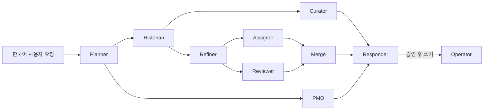

# 에이전트 프롬프트 언어 배분 비교 보고서

> 실행일: 2026-08-10 (Asia/Seoul)
> 모델: `gpt-4o-mini`
> 데이터 환경: `JIRA_ENV=mock` (`jira820`, 결정론적 인프로세스 목)
> 비교 대상: BASE / KO / EN / GUIDE

> **2026-08-10 후속 감사 정정**: 최초 하네스는 API가 분리해 반환하는
> `pending.children`을 읽지 않고 `pending.items[*].children`만 세어, 실제 Sub-Task도
> 모두 0건으로 기록했다. 아래 S1의 기존 "자식 0" 판정은 제품 결함이 아니라 **계측 결함**이다.
> 하네스를 수정한 BASE 재실행에서는 부모 Task 1건 + Sub-Task 3건, 요구 구조·응답/카드
> 불일치 모두 0건을 확인했다. 시간·토큰·호출 등 나머지 원시 지표는 이 정정의 영향을 받지 않는다.

**실제 출력과 사람 검토 근거:** [네 실험군의 실제 출력 및 인간 정성평가 부록](./PROMPT-LANGUAGE-OUTPUTS.md)

## 1. 결론

현재 증거로는 **기존 혼합안(BASE)을 프로덕션 기준선으로 유지**하는 것이 가장 안전하다.

- BASE와 GUIDE는 생성 계약 배터리에서 공동 1위(`18/23`)였다.
- BASE는 대화 배터리의 모델 처리 시간과 생성 배터리 비용에서 GUIDE와 거의 같은 수준이지만, 사람 검토에서 GUIDE보다 사실성·일관성이 안정적이었다.
- EN은 대화 배터리 토큰이 가장 적었지만(`261,318`), 생성 계약은 `16/23`이고 두 사례에서 질문 후 처리 계약이 퇴행했다.
- KO는 정적 프롬프트와 런타임 토큰이 가장 크고, 호출 수·비용·계약 점수도 열세였다. 전면 한글화의 이점은 관찰되지 않았다.
- GUIDE는 정적 토큰이 가장 작고 생성 비용도 가장 낮았지만, 실제 호출 수와 대화 토큰은 BASE보다 늘었다. 더 중요하게는 관련 문서의 `DL-9092` API 개선 수치(`20초 → 1.2초`)를 아직 남아 있던 `DL-9090` 성능 측정의 완료 결과로 잘못 귀속한 사례가 있어 자동 점수만으로 채택할 수 없다.

따라서 이번 1회 실행의 실무 권고는 다음과 같다.

1. BASE를 유지한다.
2. 언어와 무관한 절 프루닝·검사 개선만 별도로 검토한다.
3. GUIDE의 영어 도구 설명은 즉시 병합하지 않고, 아래에 제안한 체커 보강과 다회 무작위 재실험 뒤 다시 판단한다.
4. KO 전면 전환은 중단한다.

이 결론은 "영어가 본질적으로 우월하다"는 뜻이 아니다. 이번 시스템에서는 언어보다 **분기 안정성, 도구 호출 횟수, 응답과 구조화 카드의 일치, 근거 검증**이 품질을 더 크게 좌우했다.

## 2. 먼저 확인해야 할 실험군 정의 문제

사용자가 원한 네 안과 현재 브랜치가 구현한 네 안은 완전히 일치하지 않는다.

| 이름 | 커밋 | 실제 구현 | 사용자 표현과의 차이 |
|---|---:|---|---|
| BASE | `3f388b6` | common/roles는 주로 영어, playbook·도구 설명·출력 계약은 한국어인 기존 혼합 | 일치 |
| KO | `901b115` | common/roles/playbook과 도구 설명을 한국어로 사용; 식별자·파라미터는 영어 유지 | 실질적으로 "전부 한글"에 가장 가까움 |
| EN | `287a056` | common/roles/playbook은 영어지만 **41개 도구 설명은 한국어 유지** | 엄밀한 "전부 영어"가 아님 |
| GUIDE | `e923850` | EN에 더해 41개 도구 설명도 영어; 사용자 입력·최종 출력은 한국어 | 커밋에 기록된 추천안 |

GUIDE 커밋 메시지에 기록된 추천 기준은 "system/developer prompt, tool name, parameter, enum, tool description은 영어; 사용자 입력과 최종 응답은 한국어"다. 이 정의는 사용자가 말한 "전부 영어(사용자 입출력은 한국어)"와 상당 부분 겹친다. 반면 현재 EN은 사실상 **영어 프롬프트 + 한국어 도구 설명**이라는 별도의 중간안이다.

따라서 이번 결과는 실제 네 구현을 비교하는 데는 유효하지만, 개념적으로 서로 독립된 "전부 영어"와 "추천 배분"을 완전히 판별했다고 볼 수 없다. 공유된 ChatGPT 대화는 로그인되지 않은 세션에서 본문을 읽을 수 없었으므로, 추천안의 출처는 GUIDE 커밋 메시지와 실제 diff를 기준으로 복원했다.

## 3. 프로젝트와 에이전트 구조

Lake Task Manager는 FastAPI 백엔드와 Vue 3 no-build SPA로 구성되며 Jira Data Center 8.20.8 및 Confluence 9.2.4 연동을 목표로 한다. 이번 평가는 외부 Jira가 아니라 결정론적 `jira820` 목 월드를 사용했다.

에이전트는 LangGraph 기반 9개 역할로 구성된다.



- Planner: 의도와 경로 결정
- Historian: Jira/문서/사람 검색과 근거 수집
- PMO: 현황·우선순위·리스크 분석
- Curator: 수집 근거를 답변 구조로 정리
- Refiner: 티켓 초안 및 질문 구조화
- Assigner: 담당자 추천
- Reviewer: 초안 검토
- Operator: 승인 토큰을 확인한 실제 쓰기
- Responder: 사용자에게 보이는 한국어 최종 응답

핵심 설계 원칙은 "판단은 모델, 보장은 코드"다. 쓰기 작업은 내용 해시에 묶인 승인 토큰을 요구하고, 프롬프트는 common/role/playbook을 역할별로 조합하며, 검색 결과는 데이터 블록으로 격리한다. 이번 평가가 드러낸 핵심은 코드 보장 범위 밖의 의미적 일관성이 아직 충분히 검사되지 않는다는 점이다.

## 4. 평가 방법

### 4.1 실행 순서와 배터리

각 실험군마다 공유 동적 색인을 삭제하고 다음 세 배터리를 순차 실행했다.

```text
BASE  21:08:45 ~ 21:26:13
KO    21:26:13 ~ 21:58:04
EN    21:58:04 ~ 22:25:18
GUIDE 22:25:18 ~ 22:41:54
```

1. `agent_lang_ab.py`: 6개 시나리오, 총 7턴. 전체 답변과 카드, 역할별 시간·호출·토큰, 캐시 토큰, grounding/postcheck 카운트 기록.
2. `agent_compose_eval.py`: 코멘트·본문 작성 9개 계약.
3. `agent_create_suite.py`: 생성·분할·중복·버그·속성·규칙 23개 계약과 추정 비용.

OpenAI의 현재 모델 가이드도 대표 과업의 성공률·완결성·근거와 함께 토큰·지연·비용을 측정하고, 지시는 간결하게 유지하도록 권한다. 이번 평가는 그 방향으로 정량 계약과 전체 응답의 사람 검토를 함께 사용했다. 참고: [OpenAI Model guidance](https://developers.openai.com/api/docs/guides/latest-model)

### 4.2 정성 평가 기준

자동 통과 여부와 별도로 모든 대화 배터리의 전체 한국어 답변과 하네스가 투영한 카드 JSON을
읽었다. 후속 감사에서 그 투영이 분리된 `pending.children`을 누락한다는 사실을 발견했으므로,
S1의 자식 수에 관한 최초 판정은 철회한다.

판정의 추적 가능성을 위해 대화 28턴의 입력·답변 전문·카드·질문폼과, Compose/Create 실행기가
실제로 보존한 출력 전부를 [출력 부록](./PROMPT-LANGUAGE-OUTPUTS.md)에 첨부했다. 원 실행기가
전문을 저장하지 않은 Compose/Create 성공 본문은 보존 한계를 명시했으며 사후에 꾸며 넣지 않았다.

- 사실성: 목 데이터의 상태·기한·코멘트·문서와 맞는가
- 완결성: 사용자가 요구한 티켓/하위 작업/담당/근거가 실제 구조에 존재하는가
- 일관성: 자연어 응답과 카드가 같은 내용을 말하는가
- 근거성: 인용 번호와 Jira 키가 실제 근거를 가리키는가
- 실용성: PM/개발자가 그대로 검토·승인할 수 있는가

## 5. 정적 프롬프트 크기

`tiktoken`의 `gpt-4o-mini` 인코딩으로 prompt asset과 41개 도구 설명을 별도 계수했다. 실제 호출에서는 역할별 절 프루닝이 적용되므로 이 값은 "한 호출의 입력"이 아니라 정적 자산 규모다.

| 실험군 | Prompt asset tokens | Tool description tokens | 합계 | BASE 대비 |
|---|---:|---:|---:|---:|
| BASE | 16,839 | 6,292 | 23,131 | 기준 |
| KO | 21,244 | 6,292 | 27,536 | +19.0% |
| EN | 16,432 | 6,292 | 22,724 | -1.8% |
| GUIDE | 16,432 | 4,948 | 21,380 | -7.6% |

한국어는 이 프롬프트 집합에서 토큰 효율이 낮았다. 그러나 GUIDE가 보여주듯 정적 크기 감소가 곧 런타임 토큰 감소를 뜻하지는 않는다. 분기나 재호출이 한 번만 늘어도 정적 절감분을 쉽게 상쇄한다.

## 6. 정량 결과

### 6.1 대화·검색 배터리

| 실험군 | 7턴 벽시계 | LLM 호출 | 총 토큰 | Prompt | Completion | Cached | 자동 grounding/postcheck 위반 |
|---|---:|---:|---:|---:|---:|---:|---:|
| BASE | **158.1s** | 37 | 276,387 | 266,639 | **9,748** | 150,784 | 0 / 0 |
| KO | 416.9s | 41 | 352,643 | 341,778 | 10,865 | 209,024 | 0 / 0 |
| EN | 368.5s | **36** | **261,318** | **251,175** | 10,143 | **146,944** | 0 / 0 |
| GUIDE | 168.6s | 40 | 299,471 | 288,270 | 11,201 | 216,320 | 0 / 0 |

BASE 대비 총 토큰은 KO `+27.6%`, EN `-5.5%`, GUIDE `+8.4%`였다. EN의 총 토큰은 가장 적지만 호출과 결과 계약을 함께 보아야 한다.

벽시계 시간은 언어 효과로 해석하면 안 된다. 역할별 기록 시간을 합하면 BASE 약 `152.1s`, KO `211.2s`, EN `161.9s`, GUIDE `170.2s`다. KO와 EN에는 각각 약 200초의 외부 대기/재시도 구간이 있었으며, 한 시나리오의 벽시계와 노드 합계가 크게 달랐다. 고정 실행 순서와 공급자 rate limit이 섞였기 때문에 시간 순위는 참고값이다.

### 6.2 역할별 런타임 토큰

| 실험군 | 가장 큰 역할 | 두 번째 | 특징 |
|---|---|---|---|
| BASE | Historian 65,713 | Refiner 52,439 | Refiner 4회 |
| KO | Refiner 94,502 | Historian 72,620 | Refiner 6회, Assigner/Reviewer도 각 3회 |
| EN | Historian 65,437 | Refiner 48,695 | Refiner 4회, 전체 36호출 |
| GUIDE | Refiner 71,280 | Historian 62,812 | Refiner 5회, Responder 8회 |

KO의 비용 증가는 단순히 한국어 문장이 토큰을 더 쓰는 것뿐 아니라 Refiner와 후속 역할의 추가 호출로 증폭됐다. GUIDE도 가장 작은 정적 자산과 달리 Refiner/Responder 호출 증가로 BASE보다 런타임 토큰이 많았다.

### 6.3 작성·생성 계약 배터리

| 실험군 | Compose | Compose 시간 | Create | Create 시간 합 | Create 비용 | 전체 계약 통과 |
|---|---:|---:|---:|---:|---:|---:|
| BASE | 8/9 | 25s | **18/23** | 863s | $0.271 | **26/32** |
| KO | 8/9 | 27s | 16/23 | 1,463s | $0.355 | 24/32 |
| EN | 8/9 | 29s | 16/23 | 1,233s | $0.289 | 24/32 |
| GUIDE | 8/9 | 27s | **18/23** | **795s** | **$0.253** | **26/32** |

Create 실패 ID는 다음과 같다.

- BASE: `STR2`, `PASTE1`, `PASTE2`, `BUG1`, `BUG2`
- KO: `ONE1`, `PAR1`, `PASTE1`, `PASTE2`, `STARR1`, `BUG1`, `BUG2`
- EN: `STR2`, `PASTE1`, `PASTE2`, `ASK1`, `ASK2`, `BUG1`, `BUG2`
- GUIDE: `STR2`, `PASTE1`, `PASTE2`, `BUG1`, `BUG2`

여기에는 후속 감사에서 발견한 중요한 평가기 결함이 있다. 당시 공통 본문 게이트는 Bug에도
Task용 `배경/작업 범위/완료 조건`을 요구했다. 따라서 네 실험군 모두에서 실패한 `BUG1/BUG2`에는
제품 출력이 아니라 체커의 거짓 음성이 섞여 있다. 원 실행 로그에는 모든 최종 본문이 재채점 가능한
형태로 보존되지 않아 위 표를 사후에 임의 보정하지 않았다. 이 수치는 **당시 하네스의 관측값**이며,
실제 절대 계약 준수율로 읽어서는 안 된다. 네 군에 공통으로 적용된 오류라 상대 순위의 단독 근거로도
사용하지 않고 정성 검토와 함께 해석했다.

Compose는 모두 8/9였지만 실패가 같지는 않았다. BASE/EN/GUIDE는 `CMP6` 멘션·키 마크업, KO는 `CMP1` 진행 코멘트 계약에서 실패했다.

## 7. 사람 관점의 정성 평가

아래 점수는 자동 체커 점수가 아니다. 한 명의 검토자가 실제 응답을 PM/개발자가 검토·승인하는
상황으로 읽고 1점(실무 사용 불가)부터 5점(거의 수정 없이 사용 가능)까지 매긴 상대 평가다.
세부 근거와 해당 원문은 [출력 부록 B~D](./PROMPT-LANGUAGE-OUTPUTS.md)에 함께 실었다.

| 실험군 | 정확성 | 맥락 이해 | 가독성 | 실행 가능성 | 안전성 | 인간 종합 |
|---|---:|---:|---:|---:|---:|---:|
| BASE | 4.2 | 4.3 | 4.2 | 4.3 | 4.1 | **4.2** |
| KO | 3.8 | 3.8 | 4.0 | 3.8 | 3.7 | **3.8** |
| EN | 3.6 | 4.0 | 4.3 | 4.1 | 3.4 | **3.9** |
| GUIDE | 3.3 | 3.5 | 4.1 | 3.6 | 3.0 | **3.5** |

이 점수는 표본 1회에 대한 사람 판정이므로 통계적 유의성을 뜻하지 않는다. 다만 자동 검사기가
놓친 기한 오판, 수치 오귀속, 질문과 초안의 동시 생성, 최상위 Sub-Task 생성 같은 위험을 결과에
반영한다는 점에서 자동 통과율을 보완한다.

### 7.1 시나리오별 판정

| 시나리오 | BASE | KO | EN | GUIDE |
|---|---|---|---|---|
| S1 티켓 생성 | 질문 흐름은 양호; 최초 자식 수는 계측 오류로 판정 철회 | 질문 흐름은 양호; 최초 자식 수는 계측 오류로 판정 철회 | 질문 흐름은 양호; 최초 자식 수는 계측 오류로 판정 철회 | 첫 턴부터 성급한 초안; 최초 자식 수는 계측 오류로 판정 철회 |
| S2 버그 초안 | 가장 풍부하고 실용적 | 정확, P3 기본값 명시 | 대체로 정확하나 상태 서술 모순 | 대체로 정확 |
| S3 변경 이력 | 사실은 맞지만 인용 번호 매핑 오류 | 구조·인용이 가장 안정적 | 구조·인용이 정확 | 구조·인용이 정확 |
| S4 담당 업무 | 완료 티켓 포함, 매우 불완전 | 활성/수정 구분은 하나 불완전 | 네 안 중 가장 넓은 5건, 과거 기한을 "임박"으로 표현 | 완료 티켓 포함, 불완전 |
| S5 우선순위 | **가장 정확**: D+1/D+9와 우선순위 | 방향은 맞지만 날짜 정밀도 부족 | DL-9028을 9일 지연으로 오판 | 방향은 맞지만 정밀도 부족 |
| S6 지연 분석 | **직접 코멘트+문서 근거가 좋음** | 정확하지만 근거가 반복적 | 직접 근거가 풍부함 | 지연 원인·날짜 일부가 근거보다 강함 |

사람 검토의 종합 순위는 **BASE ≈ EN > KO > GUIDE**다. 단, EN은 토큰 효율과 일부 검색 커버리지가 좋은 대신 생성 계약 퇴행과 기한 사실 오류가 있어 BASE를 대체할 정도는 아니다.

### 7.2 후속 감사에서 확인한 S1 계측 결함

S1의 두 번째 요청은 "단계별 Sub-Task"를 명시했다. 최초 하네스는 사용자 답변에는 하위 작업이
있지만 카드 JSON의 `자식` 배열은 비어 있다고 기록했다. 그러나 이는 실제 승인 payload를 잘못
읽은 결과였다.

즉 다음 세 상태가 동시에 발생했다.

```text
실제 API shape
pending.items     = 부모 티켓 목록(children은 의도적으로 제거)
pending.children  = parent_index가 붙은 Sub-Task 목록

최초 하네스
pending.items[*].children만 확인 → 언제나 자식 0건으로 오판
```

하네스를 `pending.children` 우선 계수 방식으로 수정하고 요구 구조·응답/카드 불일치 지표를 추가했다.
수정된 BASE S1 재실행 결과는 부모 Task 1건, 자식 3건, `요구구조불일치=0`,
`응답카드불일치=0`, 후검증 위반 0이었다(`57.2s`, 12호출, 102,127토큰).

다만 후속 재현 중 모델이 새 부모를 만들지 않고 임의의 기존 부모 아래 Sub-Task만 내는 별도
실패 모드가 한 번 관찰됐다. 사용자 발화에 기존 부모 키가 없고 "새 일 + 단계별 Sub-Task"를
명시한 경우에는 코드가 `Task 1건 + children`으로 정규화하도록 보강했다.

### 7.3 자동 검증이 놓친 사실 오류

네 실험군 모두 자동 `grounding=0`, `postcheck=0`이었지만 사람 검토에서는 다음을 발견했다.

- BASE S3: 본문 사실은 맞지만 번호 인용 `[1]`, `[2]`가 다른 Jira 항목을 가리킴.
- BASE/KO/GUIDE S4: "현재 맡은 일"에 완료 티켓을 포함하고, 실제 열린 담당 업무의 극히 일부만 제시.
- EN S4: 기준일보다 이미 지난 `2026-08-08` 기한을 "임박"으로 표현.
- EN S5: 목 데이터에서 D+1인 `DL-9028`을 9일 지연으로 오판.
- GUIDE Compose CMP5: 관련 문서의 `DL-9092` API 개선 수치(`20초 → 1.2초`)를 현재 `DL-9090`의 성능 측정 결과로 옮기고, 자료에는 "남은 일"인 성능 측정이 완료됐다고 단정.
- GUIDE S6: 지연 원인과 날짜를 근거가 뒷받침하는 수준보다 강하게 단정.

따라서 현재의 0건 위반은 "사실 오류가 없음"이 아니라 "현 체커가 잡는 문자열/키 수준 위반이 없음"을 의미한다.

### 7.4 Create 체커의 거짓 양성·거짓 음성

일부 계약은 설명보다 체커가 약하다.

- `ASK1`: 설명은 "무턱대고 만들지 않는다"지만 체커는 질문 존재만 확인한다. BASE/KO/GUIDE는 초안 1건과 질문을 동시에 내고도 통과했다.
- `DUP1`: 중복이면 새로 만들지 말아야 하지만 질문 또는 응답 키만 있으면 통과한다. BASE/KO/EN/GUIDE 모두 초안을 함께 만들 가능성을 막지 않는다.
- `RULE1`: 최상위 Sub-Task를 거절해야 하지만 질문이 있거나 타입만 바꾸면 통과할 수 있다. BASE는 일반 Task로 바꿔 만들었고, GUIDE는 `structure=subtask`를 내면서도 통과했다.
- `BUG1/BUG2`: Bug 본문은 `재현 단계/기대 결과/실제 결과`로 평가해야 하지만, 원 체커는
  Task용 `배경/작업 범위/완료 조건`을 요구했다. 네 실험군에 공통으로 거짓 음성을 만들었다.

따라서 자동 `18/23`을 실제 사용자 계약 준수율로 그대로 읽어서는 안 된다. 후속 체커는
질문과 초안의 배타성을 강제하고, 본문 계약을 이슈 유형별로 분리했다.

## 8. 해석

### BASE

가장 균형이 좋다. 대화 배터리의 처리 시간과 생성 계약이 안정적이고, 우선순위·지연 분석의 근거 품질이 좋았다. 약점은 인용 매핑과 담당 업무 완결성이다. 최초의 하위 카드 생성 실패 판정은 계측 오류로 철회했다.

### KO

한국어 역할 프롬프트가 한국어 최종 문장의 자연스러움을 눈에 띄게 개선하지 않았다. 반대로 정적 토큰, 호출, Refiner 반복, 비용이 모두 증가했다. S3 이력 정리는 우수했지만 전면 전환을 정당화할 정도의 일관된 이득은 아니다.

### EN

런타임 토큰과 호출 수는 가장 좋았다. 이력·담당 업무 검색도 상대적으로 강했다. 그러나 생성 계약 `ASK1/ASK2` 퇴행과 기한 사실 오류가 있으며, 도구 설명이 한국어라 엄밀한 전면 영어안도 아니다. "영어 playbook + 한국어 tool description"이라는 독립 실험군으로 보존할 가치는 있다.

### GUIDE

정적 토큰과 생성 배터리 비용은 가장 좋고 자동 계약 점수는 BASE와 같다. 하지만 대화 배터리에서는 BASE보다 3회 더 호출하고 23,084토큰을 더 썼으며, S1 성급한 생성과 Compose의 `DL-9092` 수치·상태를 `DL-9090`에 옮긴 오귀속이 치명적이다. 영어 도구 설명이 도구 사용의 의미 정확도를 보장한다는 증거는 이번 실행에서 나오지 않았다.

## 9. 한계

- 각 실험군을 한 번만 실행해 모델 변동성을 분리하지 못했다. 동일 EN도 과거 실행과 이번 실행에서 첫 턴의 질문/초안 행동이 달랐다.
- 순서가 BASE → KO → EN → GUIDE로 고정돼 rate limit과 시간대 효과가 언어 효과와 섞였다.
- 약 200초의 외부 대기 구간이 KO와 EN에 있어 원시 벽시계 비교는 공정하지 않다.
- 공급자 캐시 토큰과 호출 경로가 실험군마다 달랐다.
- 동적 인덱스는 매 실험군 초기화했지만 공급자 측 캐시·부하는 통제하지 못했다.
- EN과 GUIDE의 개념적 경계가 사용자가 원한 2번/4번 경계와 겹친다.
- 정성 점수는 한 명의 검토자가 전체 답변을 읽어 판정한 결과다. 재현 가능한 사실 항목은 목 데이터와 대조했지만, 문장 품질에는 판단이 포함된다.

## 10. 다음 실행 전에 고칠 것

우선순위 순이다.

1. **응답–카드 일치 검사**: 답변에 하위 작업을 언급하면 분리된 `pending.children` 수와 제목이 일치해야 한다. **적용 완료**.
2. **명시적 구조 계약**: "Sub-Task로" 요청한 S1을 `자식 >= 2`로 실패 처리한다. **적용 완료**.
3. **무초안 계약 강화**: `ASK1`, `DUP1`, `BUG1`은 질문뿐 아니라 `items == []`도 강제한다. **적용 완료**.
4. **의미 grounding**: 인용 번호→키 매핑, 상태(완료/진행), 기준일 대비 due date 방향, 수치가 근거에 존재하는지를 검사한다.
5. **목록 완결성 지표**: "현재 맡은 일" 요청은 검색 결과 총수, 반환수, 생략 안내를 기록한다.
6. **시간 계측 분리**: 모델 처리, rate-limit 대기, 재시도 backoff를 별도 필드로 남긴다.
7. **실험군 재정의**: 사용자 2번과 4번의 차이를 문장 단위로 고정하고, 실제 파일별 언어 manifest를 저장한다.
8. **반복·무작위 실행**: 최소 3~5 seed, 실행 순서 무작위화 또는 Latin square, median/p95와 신뢰구간을 보고한다.

## 11. 권장 재평가 게이트

다음 조건을 만족하기 전에는 언어 브랜치를 프로덕션에 병합하지 않는다.

- S1 계측·구조 정규화와 BUG1 무초안 계약 유지, PASTE 계열 수정
- 강화된 Create 계약에서 치명 실패 0건
- 사람 검토의 사실 오류 0건
- 각 실험군 최소 3회 반복
- BASE 대비 총 토큰 또는 비용 5% 이상 개선
- 품질 하락 없이 p50 모델 처리 시간이 같거나 개선

그 후 의사결정은 다음처럼 단순화할 수 있다.

- GUIDE가 강화 계약과 사람 사실 검토를 통과하면서 비용 우위를 유지하면 영어 도구 설명을 채택한다.
- EN만 토큰 우위를 유지하면 영어 playbook과 한국어 도구 설명의 혼합을 후보로 둔다.
- 차이가 재현되지 않으면 번역 비용과 유지보수 중복을 피하고 BASE를 유지한다.

## 12. 원시 산출물

- 사람이 바로 읽을 수 있는 실제 출력·정성평가 부록: [`PROMPT-LANGUAGE-OUTPUTS.md`](./PROMPT-LANGUAGE-OUTPUTS.md)

- 대화 JSON: `ab-base.json`, `ab-ko.json`, `ab-en.json`, `ab-guide.json`
- 대화 로그: `log-*-ab.txt`
- Compose 로그: `log-*-compose.txt`
- Create 로그: `log-*-create.txt`
- 전체 순차 실행 기록: `run-arms.log`
- 재실행 스크립트: `run-arms.sh`
- 후속 S1 단계별 산출물: `ab-fixed-s1.json` ~ `ab-fixed-s1-v4.json`

위 파일은 배포 저장소 루트에 있으며, 보고서의 수치는 해당 산출물에서 다시 계산할 수 있다.
부록에는 대화 28턴의 실제 답변 전문, Compose 36건의 보존된 발췌, Create 92건의 실행 결과와
보존된 실패 출력, 그리고 이를 직접 읽고 내린 인간 판정이 들어 있다.

## 13. 후속 구현 및 검증 결과

언어 비교 뒤 공통 계약과 계측을 다음처럼 보강했다.

- blocking 질문이 남으면 임의 초안을 승인 카드에 함께 내지 않는다. 사용자가 "알아서"라고
  위임한 경우에는 반대로 질문을 버리고 완성된 초안을 유지한다.
- 기존 부모 키를 지목하지 않은 새 일의 단계별 Sub-Task 요청은 `Task 1 + children N`으로
  정규화한다. 보정 LLM과 DoD 폴백이 모두 비어도 부모 주제를 보존한 설계·구현·검증 3단계를
  결정적으로 생성한다.
- A/B 하네스가 `pending.children`을 계수하고, `요구구조불일치`와
  `응답카드불일치`를 별도로 기록한다.
- postcheck도 내부 nested draft와 API의 flat pending shape를 모두 이해한다.
- grounding의 사람 이름 정규식이 줄바꿈을 넘어 다음 라벨의 "대안"을 이름으로 오인하던
  문제를 수정했다. 실패 경고의 "무시하고 읽으세요"도 "승인하지 말고 실제 값을 확인하세요"로
  바꿨다. 같은 S1 응답을 다시 검사했을 때 grounding 위반은 0건이었다.
- 본문 보정 뒤 출처 없는 `참고/참고 사항/참고 자료/참고 문서` 불릿이 다시 생기던 순서 문제를
  최종 정리 단계에서 차단했다. Bug의 환경 정보는 근거 문서처럼 보이지 않도록
  `환경 및 추가 정보` 절로 분리하고, 체커도 Task와 Bug의 본문 계약을 각각 적용한다.
- 강화한 실모델 선택 배터리 `ASK1/DUP1/BUG1/BUG3/RULE1`은 `5/5` 통과, 모두 초안 0건과
  질문 3~4건을 반환했다(`$0.046`).
- 수정된 S1 실모델 실행은 부모 1건 + 자식 3건, 두 구조 불일치 지표 0, 후검증 위반 0이었다.
- 후속 실모델 본문 배터리 `PASTE1/PASTE2/BUG2`는 `3/3` 통과했다. 각 실행은 51초, 45초,
  46초였고 합계 비용은 `$0.045`였다. 붙여넣은 원문을 티켓 언어로 정리하면서 출처 없는 참고
  항목을 남기지 않았고, Bug는 재현·기대·실제 결과 계약을 충족했다.
- Draft/Postcheck/Grounding/Graph/Routes/Prompt integrity를 묶은 최종 로컬 회귀 테스트는
  `211 passed`였다(기존 deprecation warning 2건만 남음).
